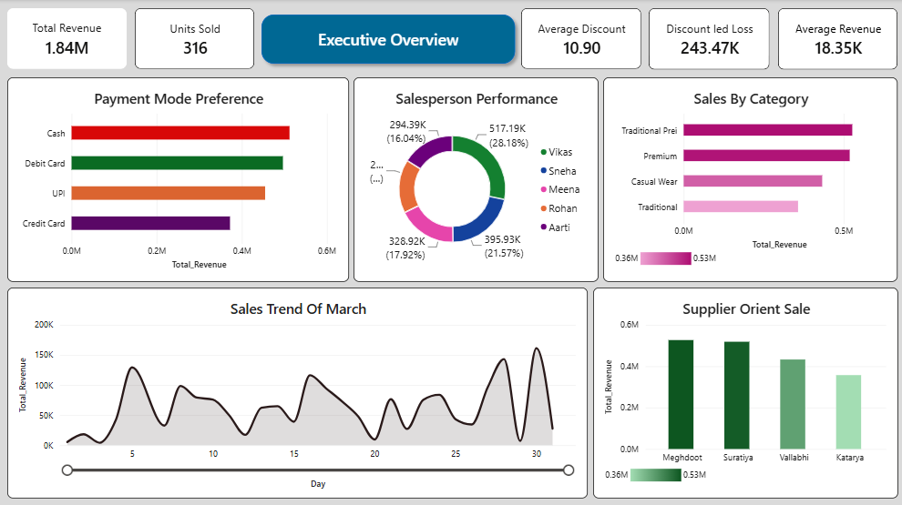
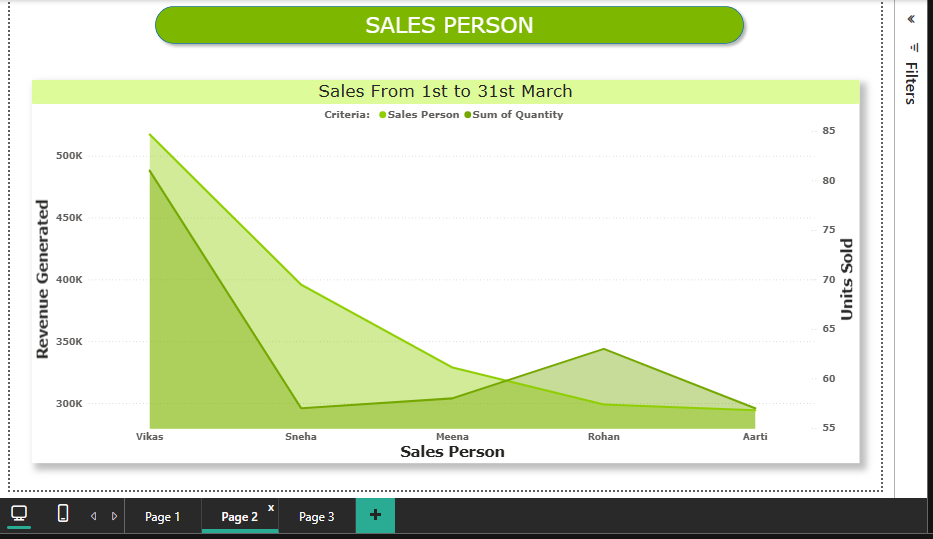
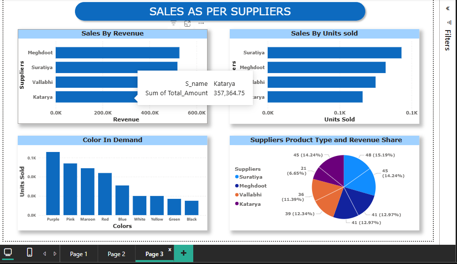
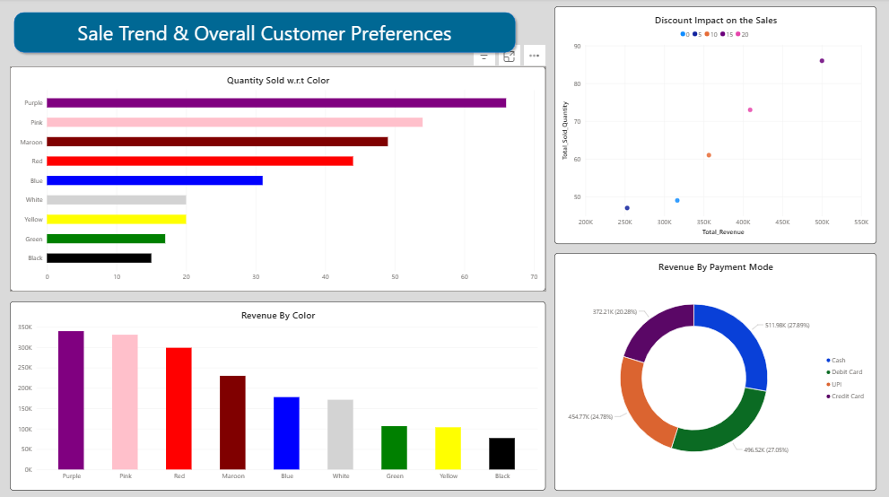

# 🛍️ Retail Sales Analysis: Saree Shop (End-to-End)

> **Tools:** SQL · MySQL Workbench · Excel · Power BI
> **Dataset:** Original self-created retail sales data based on real business reference
> **Records:** 100 sales transactions · 4 product categories · 4 suppliers · 5 salespersons

---

## 📌 Project Overview

This is an end-to-end retail sales analytics project built on original data from a real saree retail business. The project covers the full analytics pipeline; from relational database design and SQL-based insight generation to an interactive multi-page Power BI dashboard.

The goal was to analyse sales performance, supplier contribution, salesperson efficiency, discount impact, and customer colour preferences to derive actionable business insights.

---

## 🗂️ Dataset Details

| Attribute | Details |
|---|---|
| Source | Original self-created dataset based on real retail business reference |
| Period | March 2026 (30 days) |
| Total Records | 100 sales transactions |
| Product Categories | 4 (Traditional Prei, Premium, Casual Wear, Traditional) |
| Saree Types | Banarasi, Chiffon, Cotton, Designer, Georgette, Kanjivaram, Silk, Linen |
| Suppliers | 4 (Meghdoot, Suratiya, Vallabhi, Katarya) |
| Salespersons | 5 (Vikas, Sneha, Meena, Rohan, Aarti) |
| Colours | 9 (Purple, Pink, Maroon, Red, Blue, White, Yellow, Green, Black) |

---

## 🔑 Key Business Questions Answered

| # | Question | Finding |
|---|---|---|
| Q1 | Which saree type generated highest revenue? | Banarasi: Rs. 2,69,467 |
| Q2 | Which salesperson achieved highest sales? | Vikas : Rs. 5,17,188 at 81 units (28.18% share) |
| Q3 | What are top 3 best-selling colours? | Purple : 66 units · Pink: 54 · Maroon: 49 |
| Q4 | Which payment mode is most preferred? | Cash : most preferred across transactions |
| Q5 | Which date had peak revenue? | 30 March 2026 : Rs. 1,61,263 |
| Q6 | How much revenue was lost to discounts? | Rs. 2,43,473 (11.7% of gross revenue) |
| Q7 | Which category contributes most revenue? | Traditional Prei : 28.7% revenue share |
| Q8 | Which supplier leads in sales? | Meghdoot : highest supplier-oriented sales |

---

## 🛠️ SQL Techniques Used

- `GROUP BY` with `COUNT`, `SUM`, `AVG` for aggregations
- `WINDOW FUNCTIONS` ; `SUM() OVER(PARTITION BY ...)` for running totals
- `JOIN` operations across sales, category, and supplier tables
- `ANALYTICAL VIEWS` for simplified multi-table business reporting
- `DATE FUNCTIONS` ; `DAYNAME()` for peak sales day identification
- `HAVING` clause for filtered group-level analysis
- `ORDER BY` with `LIMIT` for top-N rankings
- Discount impact calculation ; base price vs actual revenue comparison

---

## 📈 Power BI Dashboard : 4 Pages

### Page 1 : Textile Business Overview

- **KPI Cards:** Total Revenue (1.84M), Units Sold (316), Avg Revenue (18.35K), Avg Discount (10.90), Discount Led Loss (243.47K), Wholesalers (4), Total Categories (4)
- **Sales Trend by Date** — area chart showing daily revenue fluctuation across March
- **Sales by Category** — horizontal bar: Traditional Prei and Premium lead revenue
- **Payment Mode Preference** — donut chart: Cash (27.89%), Credit Card (27.05%), UPI (24.78%), Debit Card (20.28%)
- **Supplier Orient Sale** — bar chart comparing revenue across all 4 suppliers

---

### Page 2 : Product Performance

- **Revenue by Sale Type** : grouped bar chart across 6 saree types per category
- **Quantity Sold by Sale Type** : grouped bar chart showing volume vs revenue relationship
- **Category Contribution %** : donut: Traditional Prei (28.7%), Premium (28.26%), Casual Wear (23%), Traditional (19.47%)
- **Category Revenue w.r.t Discounts** : scatter plot showing discount % vs total revenue per category — reveals pricing sensitivity
- **Category Contribution Treemap** : visual hierarchy of saree types within categories

---

### Page 3 : Salesperson Performance & Customer Insights

- **Revenue by Salesperson** - grouped bar chart broken down by category per salesperson
- **Revenue vs Quantity Scatter Plot** - identifies high-revenue vs high-volume salespersons
- **Average Discounts by Category** - line chart showing discount behaviour per salesperson across categories
- **Salesperson Performance Donut** - Vikas leading at 28.18% (Rs. 5,17,188), followed by Aarti (21.57%), Rohan (17.92%), Sneha (16.29%), Meena (16.04%)

---

### Page 4 : Sale Trend & Overall Customer Preferences

- **Quantity Sold by Colour** : horizontal bar: Purple (66 units) dominates, followed by Pink, Maroon, Red
- **Revenue by Colour** : bar chart: Purple and Pink generating highest revenue
- **Discount Impact on Sales** : scatter plot: revenue vs quantity relationship across discount levels
- **Revenue by Payment Mode** : donut: Cash (27.89%), Debit Card (20.28%), UPI (24.78%), Credit Card (27.05%)

---

## 💡 Key Insights

1. **Banarasi sarees** generate the highest revenue despite not being the highest volume : premium pricing drives value
2. **Vikas leads salesperson performance** at 28.18% revenue share : Traditional Prei category is his strongest
3. **Rs. 2,43,473 lost to discounts** (11.7% of gross) : reducing average discount from 10.90 could significantly improve margins
4. **Purple is the most demanded colour** at 66 units : inventory procurement should prioritise Purple and Pink
5. **Traditional Prei and Premium categories** together contribute 56.96% of total revenue ; core business drivers
6. **Payment preferences are evenly split** across Cash, Credit Card, and UPI : multi-modal payment support is essential
7. **Meghdoot leads supplier sales** : strongest supply chain partnership for high-demand categories

---

## 👤 Author

**Shantanu Rudresh Wale**
Data Analyst | Pune, Maharashtra
📧 wale.shantanu2001@gmail.com
🔗 [GitHub Profile](https://github.com/Shantanu-Wale)

---

*Dataset is original and self-created based on real retail business reference data.*
